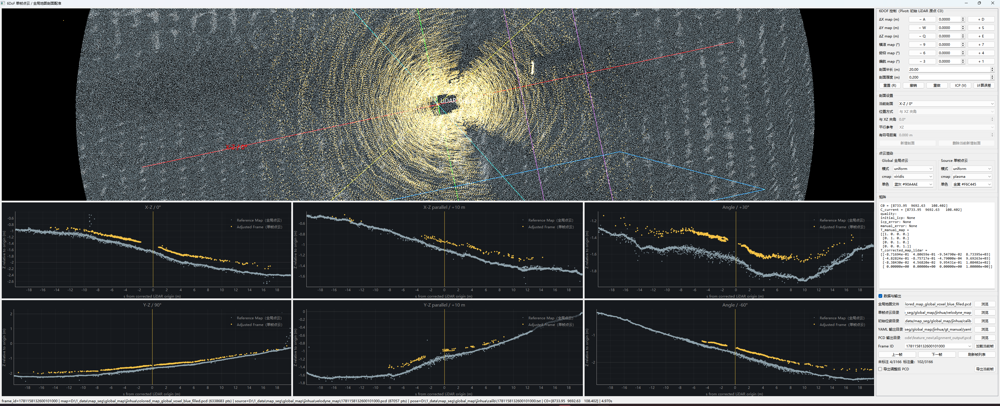
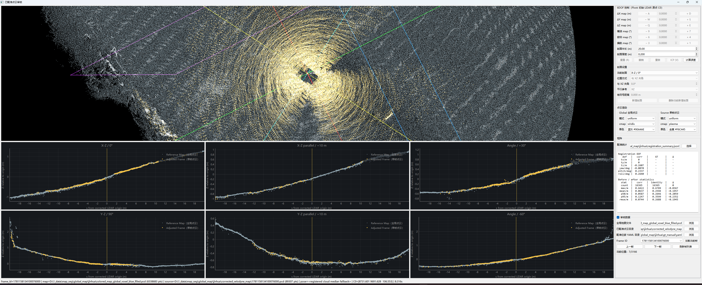

# 单帧点云与全局地图 6DOF 剖面配准工具

面向 Windows 的逐帧点云配准与复核 GUI。它用于检查**已经位于 `map` 坐标系**的单帧点云和全局地图，提供人工 6DOF 微调、剖面对比、受限 ICP、结果导出，以及已配准点云的审核模式。

推荐入口为 `src/frame_align_6dof.py`；核心代码在 `frame_alignment/`。`src/frame_register_manual.py` 是历史脚本，不是推荐入口。完整操作、字段和故障排查见 [USER_GUIDE.md](USER_GUIDE.md)。

## 适用范围

- 全局地图与单帧点云已在同一 `map` 坐标范围；
- 配准模式中，每帧有同名 `Tr_velo_to_map` TXT 初始位姿；
- 审核模式中，已有 map 坐标系的配准结果点云、可选 GT YAML 和可选 JSONL 统计。

不提供全局建图、原始 LiDAR→map 自动转换、全局粗配准、回环检测、批量无人值守配准、Web 服务或 Docker/WSL/Linux 的正式启动方案。

## 主要功能

- `register`：map 坐标系下的 ΔX/ΔY/ΔZ、roll/pitch/yaw 调整；重置、撤销、重做、误差计算和受限 point-to-plane ICP。
- 2×3 剖面：固定 XZ/YZ、默认 +10 m 平行 XZ/YZ、默认 +30°/-60° 斜剖面；最后两个可删除/重加。
- `review`：浏览已配准 map 点云，上一/下一帧自动加载；无位姿 YAML 时使用点云 XYZ 中位数作为中心。
- 审核表：JSONL 的 `corr`、YAML 的 `GT`、差值和配准前后残差统计。
- 导出同 stem YAML 和可选 PCD；覆盖确认、临时写入和回滚。

## 输入与输出

| 项目 | 要求 |
|---|---|
| 全局地图 | `.pcd`、`.ply`、`.las`、`.laz`，非空 XYZ |
| 配准模式点云 | `<frame_id>.pcd`，已在 map 坐标系 |
| 配准模式位姿 | `<frame_id>.txt`，一条 `Tr_velo_to_map:` 加 12 个数值 |
| 审核点云 | `<frame_id>.pcd`，已配准且位于 map 坐标系 |
| 审核 YAML | 可选 `<frame_id>.yaml`，含 `corrected_T_map_lidar` |
| 导出 | `<实际加载 PCD stem>.yaml`，可选同 stem `.pcd` |

单帧点云不会再次乘初始位姿；初始位姿用于 LiDAR 原点、旋转中心、ROI 和导出位姿。

## 安装与启动

在项目根目录的 Windows PowerShell 中：

```powershell
python -m venv .venv
.\.venv\Scripts\python.exe -m pip install -r .\requirements.txt
.\.venv\Scripts\python.exe .\src\frame_align_6dof.py --self-test
```

编辑 `config.yaml` 后启动：

```powershell
.\.venv\Scripts\python.exe .\src\frame_align_6dof.py --config .\config.yaml
```

相对路径相对于配置 YAML 所在目录。YAML/PCD 输出目录需在导出前创建。

### 配准模式配置

```yaml
mode: register
global_map_path: ./data/global_map.pcd
frame_cloud_map_path: ./data/frames
initial_pose_path: ./data/poses
frame_id: "1001"
output_path_yaml: ./alignment_output/yaml
output_path_pcd: ./alignment_output/pcd
interaction:
  allow_manual_adjustment: true
```


### 审核模式配置

```yaml
mode: review
global_map_path: ./data/global_map.pcd
registered_cloud_path: ./data/corrected_velodyne_map
registered_pose_path: ./data/gt_manual/yaml       # 可省略
registration_summary_path: ./data/summary.jsonl   # 可省略
frame_id: "1001"
```

审核模式只读：不允许人工调整、ICP 或导出。



### 兼容单文件命令行

`--map`、`--source`、`--pose` 必须同时给出：

```powershell
.\.venv\Scripts\python.exe .\src\frame_align_6dof.py `
  --map .\data\global_map.pcd `
  --source .\data\frames\1001.pcd `
  --pose .\data\poses\1001.txt `
  --output-dir .\alignment_output
```

`--source` 仍必须已在 map 坐标系。`--pose` 支持 TXT，或含 `matrix`、`T_map_lidar`、`initial_T_map_lidar` 的 4×4 YAML。无参数时打开空 GUI。

## 快速操作与快捷键

1. 选择地图、点云目录、位姿目录；配准模式还需选择输出目录。
2. “刷新帧列表”后选择 Frame ID。
3. 配准模式按 `Z`/点击加载；审核模式切换帧时自动加载。
4. 检查 3D 和剖面；配准模式可人工调整或运行 ICP。
5. 配准模式按 `G`/点击导出，按提示确认覆盖。

| 操作 | 快捷键 |
|---|---|
| 上/下帧 | `Left` / `Right` |
| 上/下 10 帧 | `Shift+Left` / `Shift+Right` |
| 加载当前帧 | `Z` |
| ΔX −/+ | `A` / `D` |
| ΔY −/+ | `S` / `W` |
| ΔZ −/+ | `E` / `Q` |
| roll −/+ | `9` / `7` |
| pitch −/+ | `6` / `4` |
| yaw −/+ | `3` / `1` |
| 重置/导出/误差/ICP | `R` / `G` / `C` / `V` |

6DOF、`G`、`C`、`V` 在审核模式不会修改结果。

## 审核字段概览

审核表中 `corr` 来自 JSONL 外部配准结果，`GT` 来自 YAML 的 `manual_delta_lidar`，两者统一为 LiDAR 局部坐标系、`original_to_corrected` 点云校正方向和 ZYX 欧拉角，可直接比较；`Δ = corr - GT`。

`manual_delta_about_lidar_origin` 是 GUI 中 map 坐标系的人工编辑量，旋转绕初始 LiDAR 原点，不能直接与 `corr` 比较。

## 验证

```powershell
.\.venv\Scripts\python.exe .\src\frame_align_6dof.py --help
.\.venv\Scripts\python.exe .\src\frame_align_6dof.py --self-test

$env:QT_QPA_PLATFORM='offscreen'
.\.venv\Scripts\python.exe -m pytest -q
```

`pytest` 不在 `requirements.txt`，需要另行安装。GUI 需要 Windows 桌面 OpenGL；Docker、WSL/Linux 和 LAZ 解压 backend 的正式支持范围未声明。
